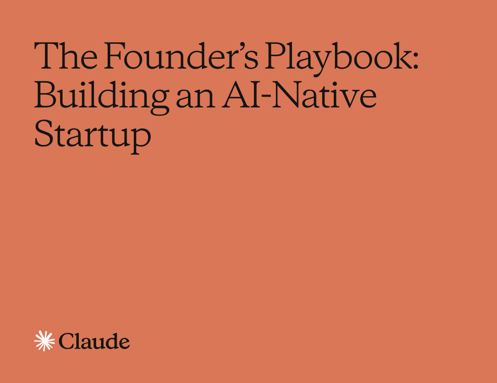

# AI-Native Founder Playbook Agent Skill

> [OPC · AI Growth Operator](https://opc.ren/)：面向 solo founders 的 AI 增长运营系统，用带来源的数据诊断业务瓶颈、反推市场与渠道策略，并持续跑通 content → publish → data reflow → review 的增长闭环。



An open-source, vendor-neutral Agent Skill that turns Anthropic's public "The Founder's Playbook: Building an AI-Native Startup" into reusable, agent-readable startup operating knowledge.

Use it with Claude Code, OpenAI Codex, Cursor, Trae, OpenClaw, hermers-agent, Gemini CLI, VS Code, GitHub Copilot, OpenCode, Goose, or any agent that can read a `SKILL.md` file and follow filesystem-based instructions. The skill helps founders and AI agents reason through the four AI-native startup stages: Idea, MVP, Launch, and Scale.

> Independent project. Not affiliated with Anthropic. Source PDFs are included under `docs/` for convenient reading and attribution; the reusable skill content is an independent synthesis.

## 中文简介

这是一个面向任意 AI agent 的开源 Agent Skill，把《The Founder's Playbook: Building an AI-Native Startup / 创业者手册：构建 AI 原生创业公司》转化为可复用的创业阶段门、验证框架、MVP scope、PMF 诊断、Launch operating system 和 Scale moat 工作流。

它适合 Claude Code、OpenAI Codex、Cursor、Trae、OpenClaw、hermers-agent、Gemini CLI、VS Code、GitHub Copilot、OpenCode、Goose 等工具。只要你的 agent 能读取项目文件，就可以通过 `ai-native-founder-playbook/SKILL.md` 使用这套方法。

核心目标不是让 agent 更快地写更多代码，而是让 agent 在正确阶段做正确的事：

- `Idea` 阶段：先验证问题、用户、市场和反证，不要把 prototype 当成 validation。
- `MVP` 阶段：用最小产品证明真实价值，同时控制 agentic technical debt、scope creep 和 security risk。
- `Launch` 阶段：把早期 traction 变成可重复增长、production readiness 和 founder-independent operations。
- `Scale` 阶段：把 domain expertise、data flywheel、workflow lock-in、GTM function 和 enterprise trust 沉淀为 moat。

## What This Skill Helps With

- Validate AI-native startup ideas before building.
- Sharpen problem hypotheses and customer discovery plans.
- Plan MVP scope without agentic coding sprawl.
- Write architecture context for coding agents.
- Detect false product-market fit.
- Build launch-stage operating systems that reduce founder bottlenecks.
- Sequence technical debt, security, compliance, and production-readiness work.
- Build scale-stage GTM, enterprise-readiness, data flywheel, and workflow lock-in narratives.
- Convert founder domain expertise into durable agent context.

## Source Documents

- [English PDF: The Founder's Playbook: Building an AI-Native Startup](docs/The-Founders-Playbook-05062026_v3.pdf)
- [中文 PDF：创业者手册：构建 AI 原生创业公司](docs/创业者手册-构建AI原生创业公司-中文.pdf)
- [Claude blog source](https://claude.com/blog/the-founders-playbook)

## Install

### Claude Code

```bash
git clone https://github.com/MackDing/ai-native-founder-playbook-skill.git
cp -R ai-native-founder-playbook-skill/ai-native-founder-playbook ~/.claude/skills/
```

### OpenAI Codex

```bash
git clone https://github.com/MackDing/ai-native-founder-playbook-skill.git
mkdir -p ~/.codex/skills
cp -R ai-native-founder-playbook-skill/ai-native-founder-playbook ~/.codex/skills/
```

### Cursor, Trae, OpenClaw, hermers-agent, and other agents

Use the project-local pattern. Copy the skill into your repository and tell the agent to read it:

```bash
git clone https://github.com/MackDing/ai-native-founder-playbook-skill.git
mkdir -p .agent-skills
cp -R ai-native-founder-playbook-skill/ai-native-founder-playbook .agent-skills/
```

Then add this instruction to your repo's agent instruction file (`AGENTS.md`, `.cursorrules`, `.cursor/rules/*.mdc`, Trae rules, OpenClaw rules, hermers-agent rules, or equivalent):

```text
When startup strategy, MVP planning, PMF, launch operations, GTM, or AI-native founder workflows are relevant, use the skill at .agent-skills/ai-native-founder-playbook. Read SKILL.md first, then load references only as needed.
```

If your client supports the Agent Skills standard directly, you can also copy `ai-native-founder-playbook/` into `.claude/skills/`, `.codex/skills/`, `.cursor/skills/`, `skills/`, or the client's equivalent skills directory.

## 中文安装

Claude Code:

```bash
git clone https://github.com/MackDing/ai-native-founder-playbook-skill.git
cp -R ai-native-founder-playbook-skill/ai-native-founder-playbook ~/.claude/skills/
```

Codex:

```bash
git clone https://github.com/MackDing/ai-native-founder-playbook-skill.git
mkdir -p ~/.codex/skills
cp -R ai-native-founder-playbook-skill/ai-native-founder-playbook ~/.codex/skills/
```

任意 agent 通用方式：把 `ai-native-founder-playbook/` 放进项目目录，例如 `.agent-skills/ai-native-founder-playbook/`，并在项目的 `AGENTS.md`、Cursor rules、Trae rules、OpenClaw rules、hermers-agent rules 或同类规则文件里声明：当任务涉及 AI-native startup、MVP、PMF、Launch、Scale、GTM、moat 或 founder workflow 时，先读取这个 Skill。

## Example Prompts

```text
Use $ai-native-founder-playbook to pressure-test this startup idea before I build the MVP.
```

```text
Use $ai-native-founder-playbook to create an MVP scope, architecture context, measurement plan, and coding-agent session template for this product.
```

```text
Use $ai-native-founder-playbook to diagnose whether our traction is real PMF or launch noise.
```

```text
Use $ai-native-founder-playbook to design a launch-stage operating system that removes me as the bottleneck.
```

中文示例：

```text
Use $ai-native-founder-playbook to 判断我的项目当前处于 Idea、MVP、Launch 还是 Scale，并给出下一步验证动作。
```

```text
Use $ai-native-founder-playbook to 为我的 AI 项目生成 MVP_SCOPE.md、architecture context、PMF dashboard 和 coding-agent session template。
```

## Repository Structure

```text
ai-native-founder-playbook/
  SKILL.md
  agents/openai.yaml
  references/
    stage-gates.md
    workflows.md
    templates.md
    source-map.md
  scripts/
    stage-checklist.mjs
assets/
  founders-playbook-cover.png
docs/
  The-Founders-Playbook-05062026_v3.pdf
  创业者手册-构建AI原生创业公司-中文.pdf
llms.txt
scripts/validate-skill.mjs
```

## For Agents And Search Engines

This repository includes `llms.txt` so AI agents and generative search systems can quickly discover the canonical skill path, purpose, install target, source documents, and source map.

Primary keywords: AI-native startup, founder playbook, Agent Skill, startup lifecycle, Idea stage, MVP stage, Launch stage, Scale stage, problem-solution fit, product-market fit, agentic coding, Claude Code, OpenAI Codex, Cursor, Trae, OpenClaw, hermers-agent, startup operating system, GEO, SEO.

中文关键词：AI 原生创业公司、创业者手册、Agent Skill、创业阶段门、问题验证、MVP、产品市场匹配、PMF、agentic coding、Claude Code、Codex、Cursor、Trae、OpenClaw、hermers-agent、增长系统、创业 operating system。

## Sources

- Anthropic / Claude blog: [The founder's playbook: Building an AI-native startup](https://claude.com/blog/the-founders-playbook)
- Included English PDF: [The Founder's Playbook: Building an AI-Native Startup](docs/The-Founders-Playbook-05062026_v3.pdf)
- Included Chinese PDF: [创业者手册：构建 AI 原生创业公司](docs/创业者手册-构建AI原生创业公司-中文.pdf)
- Public PDF: [The Founder's Playbook: Building an AI-Native Startup](https://cdn.prod.website-files.com/6889473510b50328dbb70ae6/69fe2a55b93bb0732b1fe33c_The-Founders-Playbook-05062026_v3%20(1).pdf)
- Agent Skills overview: [agentskills.io](https://agentskills.io/home)
- Agent Skills specification: [agentskills.io/specification](https://agentskills.io/specification)
- Skill creator best practices: [agentskills.io/skill-creation/best-practices](https://agentskills.io/skill-creation/best-practices)

## Validation

```bash
npm test
node ai-native-founder-playbook/scripts/stage-checklist.mjs idea
```

## License And Attribution

This repository's original synthesis, skill instructions, scripts, and templates are released under the MIT License.

The source playbook and Claude-related trademarks belong to their respective owners. This project summarizes and operationalizes publicly available ideas for agent workflows and includes the source PDFs for convenient reading and attribution.
